## Implémentation de la Vue Accueil

### 1. Architecture de l'Écran d'Accueil

La vue d'accueil est assez simple :

* **Le Conteneur Principal (`VBox`) :** Placé directement à la racine de la `Scene`, ce conteneur vertical aligne et centre automatiquement tous les éléments graphiques au milieu de la fenêtre.
* **Le Titre (`Label`) :** Un composant textuel de grande taille affiche le nom du jeu : `FLIP 7`. 
* **Les Boutons d'Action (`Button`) :** Disposés en dessous du titre, ils matérialisent les commandes essentielles offertes à l'utilisateur :
  * Le bouton `PLAY` permet d'initier une nouvelle partie de Flip7.
  * Le bouton `RULES` (prévu dans la maquette) redirige vers les instructions du jeu.
  * Le bouton `EXIT` ferme proprement l'application.

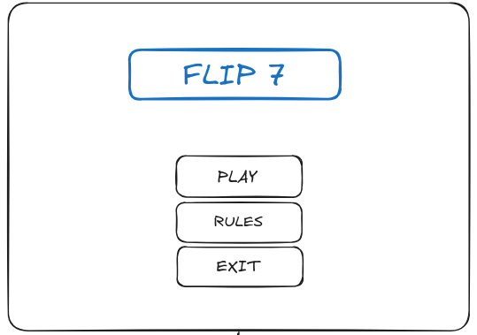
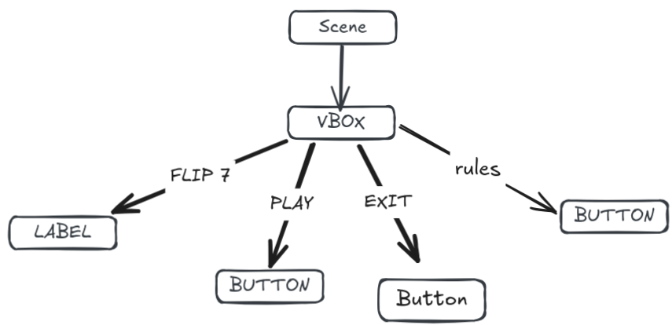

---

## Implémentation de la Vue Règles

### 1. Architecture et Disposition de l'Écran des Règles

* **La Zone Centrale (`Center`) :** Afin de garantir la bonne lisibilité d'un texte long, l'affichage intègre un `ScrollPane`. Ce composant gère automatiquement l'apparition de barres de défilement si le contenu dépasse de l'écran. À l'intérieur, un conteneur `TextFlow` accueille et structure les différents blocs textuels (`Text` pour le titre, `Text` pour la règle 1, etc.), permettant d'aligner le texte de manière fluide.
* **La Zone Inférieure (`Bottom`) :** Placé tout en bas de l'interface, un bouton JavaFX unique (`Button`) libellé `RETOUR` pour quitter le menu et revenir à l'écran d'accueil du jeu.

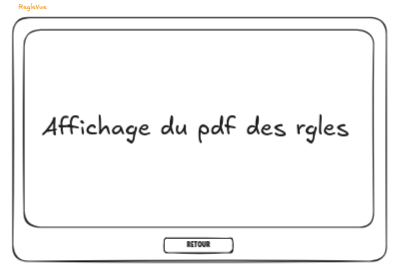
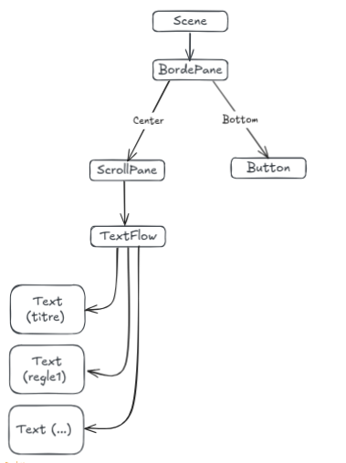

___

## Implémentation de la Vue Sélection des Joueurs

### 1. Architecture et Hiérarchie des Composants

L'arborescence distribue l'espace en trois grands blocs de haut en bas :

* **L'En-tête (Position 1) :** Un conteneur `FlowPane` centre le titre principal (`Label`) affichant "SÉLECTION DES JOUEURS".
* **La Zone Centrale de Gestion (Position 2) :** Grâce à un `BorderPane` :
  * **À gauche (`LEFT`) :** Un `TitledPane` nommé "JOUEURS SAUVEGARDÉS" contient un `ScrollPane` et un `GridPane` pour lister et faire défiler les profils disponibles.
  * **Au centre (`CENTER`) :** Une `VBox` regroupe les deux boutons fléchés (`<` et `>`) permettant de transférer les joueurs d'une liste à l'autre.
  * **À droite (`RIGHT`) :** Un second `TitledPane` intitulé "JOUEURS DANS LA PARTIE" contient un `GridPane` affichant les participants sélectionnés pour le match.
  * **En bas (`BOTTOM`) :** Une `HBox` aligne les boutons de gestion de profil : `Ajouter Joueur`, `Modifier Joueur` et `Supprimer Joueur`.
* **La Barre de Navigation Basse (Position 3) :** Une `HBox` positionnée tout en bas sépare les deux actions de sortie de l'écran avec le bouton `RETOUR` à gauche et le bouton `PLAY` à droite pour lancer le match.

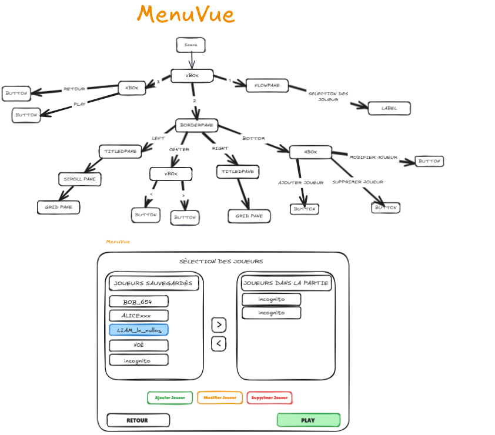
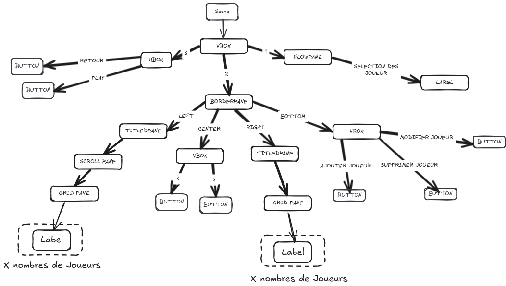

___

## Implémentation du Plateau de Jeu Principal

### 1. Architecture et Hiérarchie des Composants

L'arborescence de cette vue s'organise via un `GridPane` racine qui separe l'espace en trois blocs :

* **L'En-tête de Partie (Position `0, 0`) :** Une `HBox` regroupe horizontalement les données globales de la session.

* **La Zone Centrale des Joueurs (Position `0, 1`) :** 
  
  * `VBox` -> Liste des mains
  
    * elle contient des `HBox` -> Mains,
    
      * les mains contiennent des `VBox` -> Catégories de cartes
      
        * qui contiennent des `HBox` -> Liste des cartes contenues
        
        * ainsi que le label des cartes.

* **Le Panneau de Contrôle Latéral (Position `1, 0`) :** `VBox` de droite -> Contient une `HBox` (infos relatives à la pioche et à la défausse) et une `VBox` (boutons Piocher / Stop)

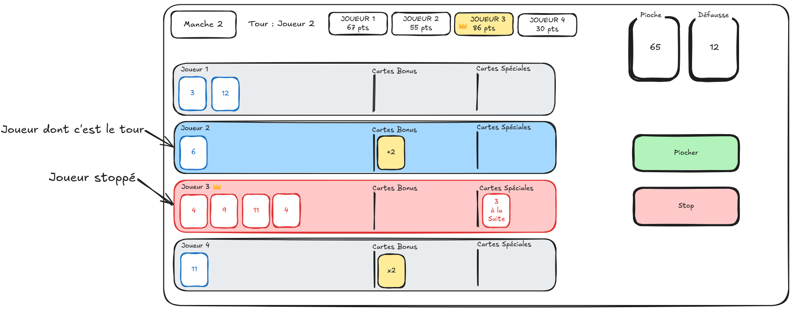
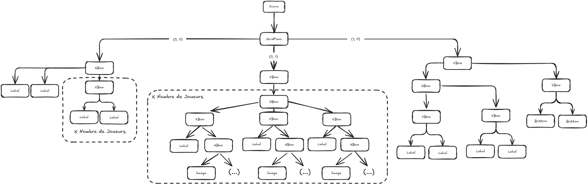

___

## Implémentation de la Vue quand un joueur cible une carte Stop ou une carte 3 a La Suite

### 1. Architecture et Hiérarchie des Composants

* La structure est pensée pour être centrée et explicite afin d'éviter toute erreur de manipulation par le joueur :

* Le Conteneur Principal (VBox) : Placé à la racine de la Scene, ce conteneur vertical assure un alignement centré des éléments. Il est configuré avec un espacement interne (padding) pour offrir un aspect propre et dégagé.

* L'En-tête (FlowPane) : Contient un Label affichant clairement l'instruction : "CHOISIR UNE CIBLE".

* La Grille de Sélection (HBox imbriquées) : Pour gérer la disposition des choix, deux conteneurs HBox sont utilisés :
  
  * Chaque HBox contient deux boutons (Button) représentant les joueurs cibles (par exemple : Joueur 1 et Joueur 2 dans la première, Joueur 3 et Joueur 4 dans la seconde).
  
  * Les boutons sont dimensionnés uniformément pour assurer une symétrie visuelle et sont colorés (rouge, vert, bleu, jaune) pour faciliter l'identification rapide des adversaires.

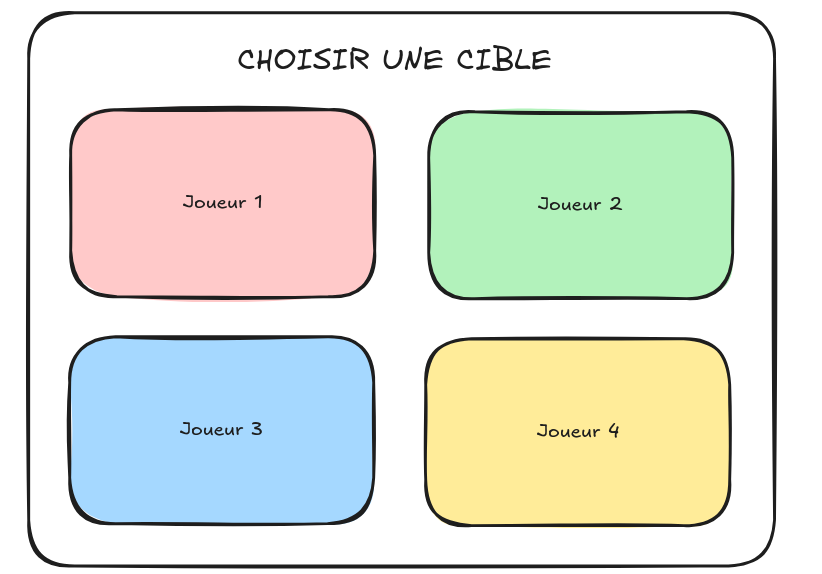
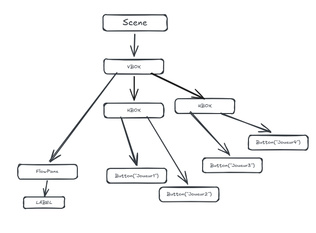

___

## Implémentation de la Vue des Scores

### 1. Architecture et Hiérarchie des Composants

* **Le Panneau Supérieur des Tableaux (Position 1) :** Grâce à un `BorderPane` :
  * **À gauche (`LEFT`) :** Une zone (`VBox` multipliée par le **Nombre de Joueurs**) affiche la liste des pseudonymes des participants (`Label`).
  * **Au centre (`CENTER`) :** Un conteneur `FlowPane` se multiplie selon le **Nombre de Manches**. À l'intérieur, chaque bloc de manche possède une `VBox` listant le score obtenu par chaque joueur (`Label`) ainsi que le numéro de la manche correspondante.
  * **À droite (`RIGHT`) :** Une `VBox` (également multipliée par le **Nombre de Joueurs**) extrait et affiche le total cumulé des points de chaque joueur sous forme de `Label`.
* **Le Panneau Inférieur Graphique et Action (Position 2) :** Structuré autour d'un second `BorderPane`, il gère l'aspect visuel et la navigation :
  * **Au centre (`CENTER`) :** Un composant de statistiques JavaFX `LineChart` est injecté pour tracer dynamiquement les courbes d'évolution des scores de chaque joueur au fil de la partie.
  * **À droite (`RIGHT`) :** Un bouton d'action contextuel (`Button`) permet de valider la transition. Son libellé s'adapte dynamiquement selon la situation ("PROCHAINE MANCHE" ou "FIN DE PARTIE" si un joueur a atteint le score cible).

### 2. Correspondance Technique et Évolution Dynamique

Cette vue repose sur une imbrication de conteneurs, capables de s'adapter automatiquement à la configuration de la partie. Les boucles de génération des lignes et des colonnes garantissent un alignement entre la liste des noms, les colonnes des manches et la colonne du total, quel que soit le nombre de joueurs.

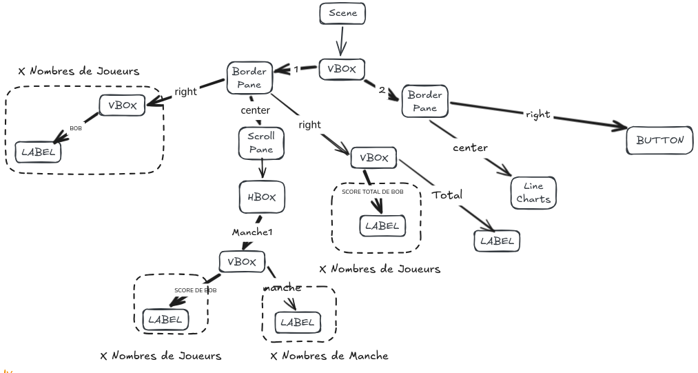
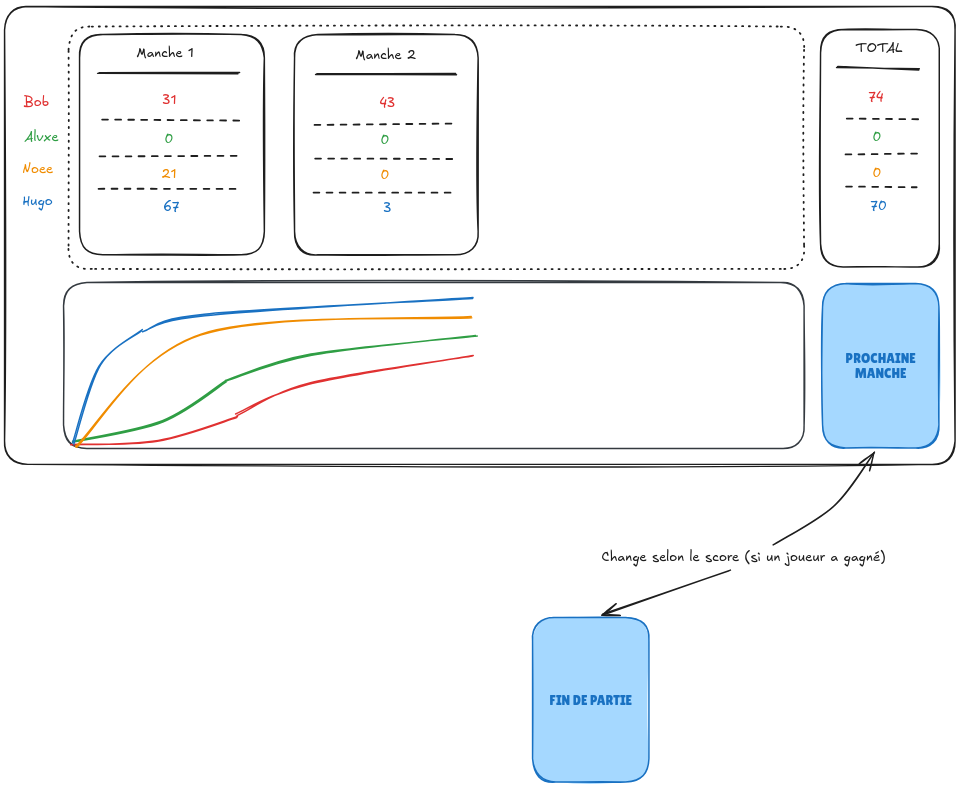

___

## Implémentation de la Vue Podium (Fin de Partie)

### 1. Architecture et Hiérarchie des Composants

* **L'En-tête de Navigation (`TOP`) :** Composée d'un sous-panneau `BorderPane`, elle structure les contrôles généraux et les salutations :
  * **À gauche (`LEFT`) :** Un composant `Button` libellé `MENU` permet de quitter définitivement le match et de retourner à l'accueil.
  * **Au centre (`CENTER`) :** Un `Label` affiche un message de félicitations global tel que "CONGRATULATIONS".
  * **À droite (`RIGHT`) :** Un composant `Button` libellé `REJOUER` réinitialise instantanément les scores pour relancer un match avec les mêmes participants.
* **La Zone d'Affichage du Podium (`CENTER`) :** Propulsée par un conteneur fluide `FlowPane`, elle orchestre visuellement la mise en valeur des scores selon le classement final (multiplié par le **Nombre de Joueurs**) :
  * Les trois premiers joueurs (1ère, 2ème et 3ème place) sont encapsulés dans des structures `VBox` dédiées. Chaque bloc associe verticalement le pseudo/score du participant (`Label`) et la marche graphique correspondante (`Label` stylisé matérialisant la hauteur de la marche).
  * Le quatrième joueur (si la partie comprend 4 participants) est placé en dehors du podium physique via un simple nœud textuel `Label`.

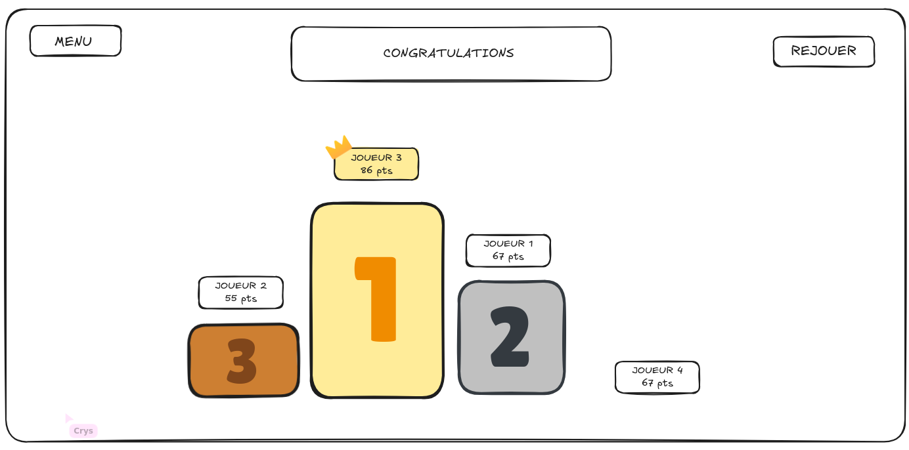
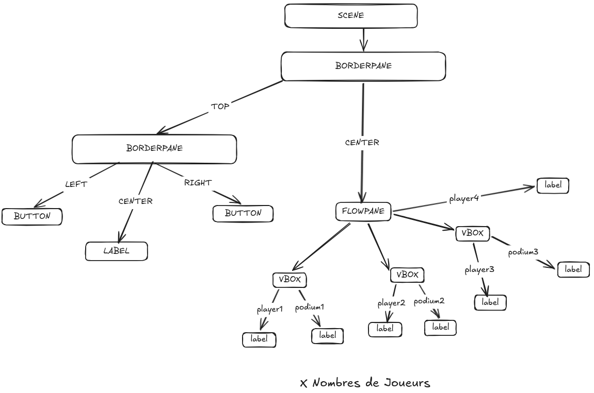

___

### 6 . Implémentation Vue Pop up

La structure de ces fenêtres est basée sur une hiérarchie simple et légère pour garantir une réactivité optimale :

* Zone Centrale (CENTER) : Contient un Label affichant le message informatif (ex: "WASTED" ou "Flip7 !"). Le style CSS est appliqué pour permettre une distinction visuelle immédiate via des codes couleurs (rose pour l'élimination, vert pour le succès).

* Zone Inférieure (BOTTOM) : Accueille un bouton Button portant la mention "OK". Ce bouton déclenche l'événement de fermeture de la pop-up et, selon le contexte, la reprise du tour de jeu ou l'affichage de l'écran des scores.

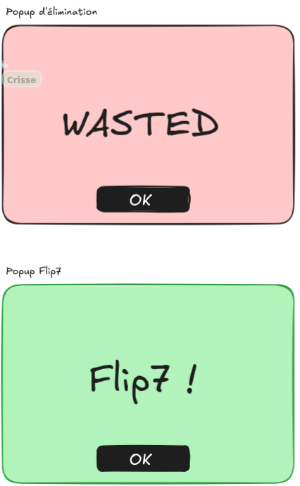
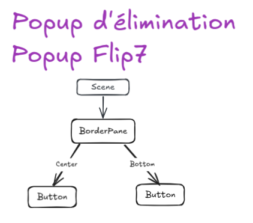
