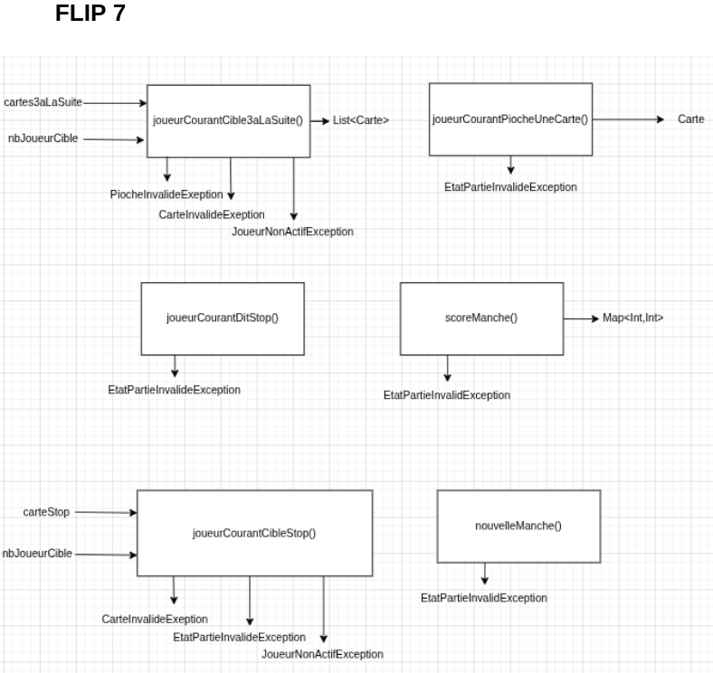
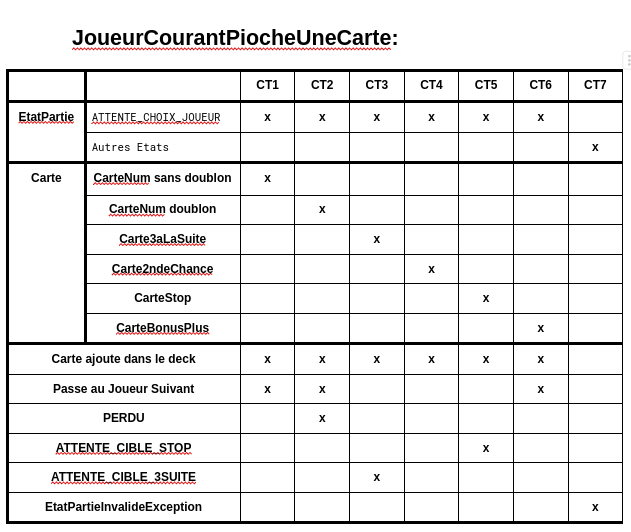
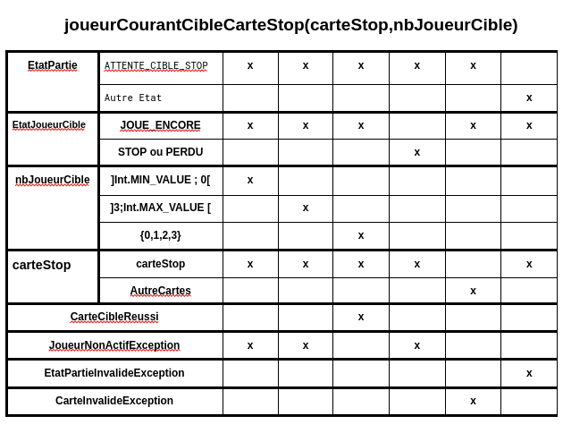
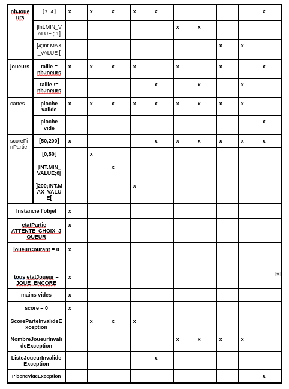
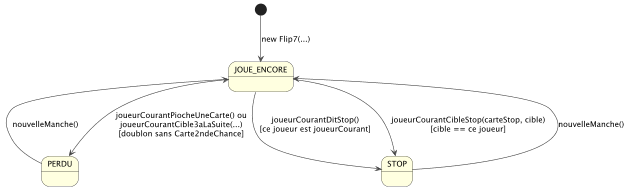

# Rapport de Test - Projet Flip7


## 1. Concevoir les tests avec une approche fonctionnelle


**Analyse fonctionnelle des interfaces**

Cette analyse fonctionelle regroupe les signatures de chaque méthode :
ce qu'on donne en entrée, ce qu'on reçoit en sortie, et les erreurs possibles. 
C'est le point de départ pour repérer les cas limites.



### Exemple de Table de Décision pour les méthode de Flip 7.
Nous avons aussi réalisé cette table pour chaque classes de la bibliotheque Flip7.Cette table de décision sert à cartographier de manière exhaustive tous les scénarios possibles lorsqu'un joueur pioche une carte via la méthode joueurCourantPiocheUneCarte(), en croisant les conditions initiales du jeu avec les actions et résultats attendus.


#### `joueurCourantPiocheUneCarte()`



**Cas de test :**

- CT1 — Pioche d'une CarteNum sans doublon : la carte est ajoutée au deck et le tour passe au joueur suivant.
- CT2 — Pioche d'une CarteNum en doublon : la carte est ajoutée, le joueur passe à l'état `PERDU`, le tour passe au suivant.
- CT3 — Pioche d'une Carte3aLaSuite : la carte est ajoutée, l'état passe à `ATTENTE_CIBLE_3SUITE`.
- CT4 — Pioche d'une Carte2ndeChance : la carte est ajoutée au deck.
- CT5 — Pioche d'une CarteStop : la carte est ajoutée, l'état passe à `ATTENTE_CIBLE_STOP`.
- CT6 — Pioche d'une CarteBonusPlus : la carte est ajoutée au deck et le tour passe au joueur suivant.
- CT7 — État invalide : lève une `EtatPartieInvalideException`.

---

#### `joueurCourantCibleStop()`



**Cas de test :**

- CT1 — Numéro de cible hors borne inférieure (`]MIN;0[`) : lève `IndiceJoueurInvalideException`.
- CT2 — Numéro de cible hors borne supérieure (`]3;MAX[`) : lève `IndiceJoueurInvalideException`.
- CT3 — Cible valide en état `JOUE_ENCORE` : la cible passe à `STOP`.
- CT4 — Cible en état `STOP` ou `PERDU` : lève `JoueurNonActifException`.
- CT5 — Carte passée n'est pas une CarteStop : lève `CarteInvalideException`.
- CT6 — État de la partie invalide : lève `EtatPartieInvalideException`.

---

#### `creerJeu()` / Constructeur



**Cas de test :**

- CT1 — Paramètres tous valides (`nbJoueurs ∈ [2;4]`, `scoreFinPartie ∈ [50;200]`, pioche valide) : objet instancié, état `ATTENTE_CHOIX_JOUEUR`, `joueurCourant=0`, tous les joueurs à `JOUE_ENCORE`, mains vides, scores à 0.
- CT2 — `scoreFinPartie ∈ [0;50[` : lève `ScorePartieInvalideException`.
- CT3 — `scoreFinPartie ∈ ]MIN;0[` : lève `ScorePartieInvalideException`.
- CT4 — `scoreFinPartie ∈ ]200;MAX]` : lève `ScorePartieInvalideException`.
- CT5 — Liste joueurs de taille différente de `nbJoueurs` : lève `ListeJoueurInvalideException`.
- CT6 — `nbJoueurs ∈ ]MIN;1]` : lève `NombreJoueurInvalideException`.
- CT7 — `nbJoueurs ∈ ]MIN;1]` et liste invalide : lève `NombreJoueurInvalideException` (priorité sur la liste).
- CT8 — `nbJoueurs ∈ ]4;MAX[` : lève `NombreJoueurInvalideException`.
- CT9 — `nbJoueurs ∈ ]4;MAX[` et liste invalide : lève `NombreJoueurInvalideException`.
- CT10 — Pioche vide : lève `PiocheVideException`.

---

### Scénarios de tests séquentiels



Les tests valident l'enchaînement des manches.

**Les Scénario d'initialisation :** Une nouvelle partie est créée via new Flip7(...). L'état initial de chaque joueur est automatiquement configuré sur JOUE_ENCORE.

**Les Scénario d'élimination par pioche :** Le joueur actif pioche une carte ou utilise un effet de carte via joueurCourantPiocheUneCarte() ou joueurCourantCible3aLaSuite(...). S'il obtient un doublon numérique et ne possède pas de carte Seconde Chance, son état bascule de JOUE_ENCORE à PERDU.

**Les Scénario d'arrêt volontaire :** Le joueur actif décide de sécuriser ses points accumulés en appelant la méthode joueurCourantDitStop(). Son état personnel bascule immédiatement de JOUE_ENCORE à STOP.

**Les Scénario de blocage subi :** Un joueur adverse cible le joueur avec une carte de blocage via la méthode joueurCourantCibleStop(carteStop, cible). Le joueur visé voit son état basculer directement de JOUE_ENCORE à STOP sans avoir choisi de s'arrêter.

**Les Scénario de réinitialisation après défaite :** La manche actuelle prend fin suite à l'élimination des joueurs. L'appel à nouvelleManche() réinitialise l'état du joueur éliminé, le faisant repasser de PERDU à JOUE_ENCORE.

**Les Scénario de réinitialisation après un arrêt :** La manche se termine après que tout le monde s'est arrêté ou a été éliminé. L'appel à nouvelleManche() réinitialise l'état du joueur en sécurité, le faisant repasser de STOP à JOUE_ENCORE.

## 2. Analyse de la testabilité

### Contrôlabilité

La pioche est mélangée aléatoirement à chaque partie. Pour y remédier, nous utilisons la méthode ```creerJeu``` qui accepte 
une liste de cartes fixe. Cela nous permet de contrôler précisément l'ordre des cartes piochées et de reproduire n'importe 
quel scénario de manière fiable et répétable.
La validation de la pioche via OutilsCarte ajoute une contrainte supplémentaire : 
la pioche doit respecter une composition exacte (1 CarteNum(0), exactement n exemplaires de CarteNum(n) pour n∈[1;12], 
1 CarteBonusMultiplie, etc.). Nos tests de OutilsCarte couvrent chaque écart possible par rapport à cette composition.
### Observabilité

Comme les états de la partie et des joueurs, ainsi que la main, le score et le joueur courant sont accessibles, 
nos tests sont particulièrement robustes. Ils s'appuient sur des oracles fiables qui permettent de vérifier l'état 
interne du système immédiatement après chaque interaction, garantissant ainsi une précision totale sans déduction nécessaire.

Chaque test crée sa propre instance via creerJeu() avec une pioche dédiée. 
Il n'y a pas de state partagé entre les tests, ce qui garantit l'indépendance des cas de test.

## 3. Implémentation des tests unitaires

Le projet utilise Kotlin et JUnit 5.

### Intentions et Oracles

```CT1_joueurCourantPiocheUneCarteNum```

* Intention : vérifier que piocher une CarteNum sans doublon se déroule normalement.

* Oracle : la carte apparaît dans flip.main[0], l'état reste ATTENTE_CHOIX_JOUEUR, et joueurCourant passe à 1.

```CT2_joueurCourantPiocheUneCarteNumDoublon```

* Intention : vérifier qu'un doublon fatal élimine le joueur.

* Oracle : la carte est bien ajoutée à la main, et l'état du joueur 0 passe à PERDU.

```CT3_joueurCourantPiocheUneCarte3aLaSuite```

* Intention : vérifier que la Carte3aLaSuite suspend le tour en attente de cible.

* Oracle : flip.etatPartie == ATTENTE_CIBLE_3SUITE immédiatement après la pioche.

```CT7_joueurCourantPiocheUneCarteEtatInvalide```

* Intention : interdire la pioche hors du bon état.

* Oracle : EtatPartieInvalideException levée, état inchangé.

```CT1_ScoreMancheScoreAtteintQueCarteNum```

* Intention : vérifier que le score est correctement calculé après un Flip7 dépassant le scoreFinPartie.

* Oracle : flip.score[0] == sommeCartes + 15 et flip.etatPartie == PARTIE_TERMINEE.

```CT6_ScoreMancheEtatInvalide```

* Intention : interdire le calcul de score hors de l'état MANCHE_TERMINEE.

* Oracle : EtatPartieInvalideException levée.

```CT1_CreerJeuValide```

* Intention : vérifier l'état initial complet d'une partie correctement configurée.

* Oracle : etatPartie == ATTENTE_CHOIX_JOUEUR, joueurCourant == 0, tous les joueurs à JOUE_ENCORE, main vide, score == 0 pour chaque joueur.

## 4. Remontée de bugs

*(Note : Détaillez ici les éventuels échecs réels. Sinon, signalez "Aucun défaut majeur détecté".)*

#### 1.Boucle infinie : Carte3aLaSuite ciblant une CarteStop
Contexte : Lorsque la Carte3aLaSuite force un joueur à piocher 3 cartes et que l'une d'elles est une CarteStop, 
la méthode joueurCourantCible3aLaSuite() entre dans une boucle infinie. Le jeu ne parvient pas à résoudre l'effet de 
la CarteStop dans ce contexte et ne change jamais d'état.

```
@Test
    fun CT3_joueurCourantPiocheUneCarte3aLaSuiteCarteSpecial() {

        var pioche = listOf(Carte3aLaSuite(), CarteStop(),CarteNum(3),CarteNum(2))

        val flip = creerJeu(pioche)

        var cartePioche = flip.joueurCourantPiocheUneCarte()

        assertEquals(EtatPartie.ATTENTE_CIBLE_3SUITE, flip.etatPartie) // True

        assertThrows<PiocheInvalideException> {
            flip.joueurCourantCible3aLaSuite(cartePioche,0)   //Infinie
        }
   
    }
```


